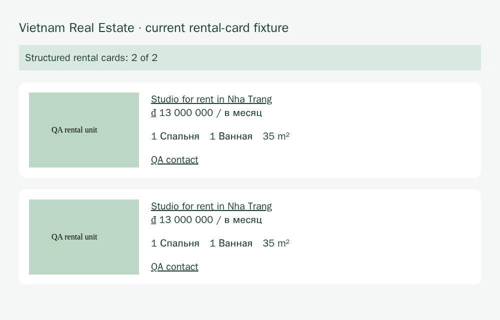

# Issue 163: native media, projection integrity and validated dependency reuse

This single PR implements the application changes for [#155](https://github.com/konard/vietnam-accomodation-search/issues/155), [#158](https://github.com/konard/vietnam-accomodation-search/issues/158), [#159](https://github.com/konard/vietnam-accomodation-search/issues/159), [#160](https://github.com/konard/vietnam-accomodation-search/issues/160), [#161](https://github.com/konard/vietnam-accomodation-search/issues/161) and [#162](https://github.com/konard/vietnam-accomodation-search/issues/162). Every issue and comment was read, including the two dependency-adoption corrections in #155. None of the six application defects was dismissed as already resolved.

**Live Telegram acceptance remains unverified.** This checkout has no authenticated owner bot/user session or protected history journal. Installed SDK fixtures, actual OCR, real clink, public browser routes and local multipart uploads are identified separately below. They do not establish delivery over Telegram, public SDK identity parity, full protected-cohort completion or a new 90-day live replay. No Telegram messages were created or deleted. Separate release configuration [#122](https://github.com/konard/vietnam-accomodation-search/issues/122) and protected-cohort durable completion [#143](https://github.com/konard/vietnam-accomodation-search/issues/143) remain open gates; this PR does not include closing references for them.

## Plan and exhaustive requirement map

The working sequence is: read all issue/comment contracts and prior merged PRs; inspect every affected consumer; research published APIs and upstream blockers; reproduce defects before changing production; implement shared boundaries; verify with installed SDK/real browser/real clink; run local quality and runtime suites; review the complete PR diff and default-branch ancestry; push the prepared branch; inspect exact-head CI and its logs; update PR 164 and mark it ready. No implementation is deferred to another PR. External acceptance limits are recorded here rather than called passing.

Each row states the requirement, plausible alternatives and the selected solution or concrete acceptance plan. Requirements originating in comments supersede the earlier wording where they conflict.

### Parent #163

| Requirement                                                               | Alternatives and selected plan                                                                | Evidence / state                                                                                                       |
| ------------------------------------------------------------------------- | --------------------------------------------------------------------------------------------- | ---------------------------------------------------------------------------------------------------------------------- |
| Read every listed issue and every comment                                 | Read issue JSON plus paginated comment endpoints, rather than relying on the umbrella summary | All six bodies and #155's two owner comments read; the remaining issues had no comments                                |
| Fully implement all six in one PR, without follow-up deferral             | Separate migrations versus shared application boundaries                                      | Shared changes and regressions in PR 164                                                                               |
| Close parent and each child with an individual keyword                    | Combined shorthand would only close the first issue                                           | PR description includes `Fixes #163` and one `Fixes` line for every child                                              |
| State any already-resolved or unreproduced issue but retain its reference | Silent omission versus explicit evidence                                                      | All application bugs reproduced; the browser and notation **upstream** blockers are now resolved, verified and adopted |

### #155: dependency adoption and preserved contracts

| Requirement                                                                                                               | Alternatives and selected plan                                                              | Evidence / state                                                                                                                                                                           |
| ------------------------------------------------------------------------------------------------------------------------- | ------------------------------------------------------------------------------------------- | ------------------------------------------------------------------------------------------------------------------------------------------------------------------------------------------ |
| Evaluate browser 0.21 → 0.26.3; gate on #134 readiness/deadline and #135 launch diagnostics                               | Keep the global tracking workaround, or adopt a published version that passes both controls | Published **0.27.0** passes both; exact pin adopted; factory-level tracking disable removed                                                                                                |
| Prefer supported navigation/lifecycle; keep container sandbox policy explicit                                             | Extra readiness emulation versus per-call options                                           | Shared `gotoPage` passes readiness, deadline and caller signal; interprets failed outcomes; existing lifecycle cleanup and explicit container policy retained                              |
| Reuse `use-m/load` only after body stalls and caller/whole-retry cancellation work                                        | Replace guarded bootstrap now, or retain proven protections                                 | 8.16.4 still fails the bounded stalled-body probe; app loader still rejects within its budget; no premature replacement                                                                    |
| Treat CommonJS #72 as fixed; remove compatibility only after runtime/Windows proof                                        | Drop every shim versus remove only obsolete branches                                        | Prior merged PR157 already removed the Windows loading skip; remaining integrity/retry code protects different contracts and stays                                                         |
| Preserve digest pin, trusted mirrors, size/deadline guards                                                                | Unbounded upstream loading versus app policy                                                | Shared release loader and all consumers remain pinned and guarded; existing tamper/body/cancellation tests retained                                                                        |
| Evaluate the existing lightweight process-runner; keep root 1.3.0 while #218 and owned-child settlement remain unresolved | Blind 2.0 major/PTY adoption versus lightweight existing runner with app lifecycle guards   | Root stays 1.3.0; browser-only 1.4.0 override satisfies its declared range and removes the vulnerable 1.6.2 dependency chain; literal argv and browser contracts pass                      |
| Retain real binary import/roundtrip, timeout/abort and literal executable-path tests                                      | Mock-only runner tests versus installed runner and binary                                   | Existing runner/binary regressions retained; native graph and poster examples add actual clink readback                                                                                    |
| Gate notation adoption on mixed quotes, formatter/parser/digests, historical Unicode/whitespace/address fidelity          | Rewrite journals versus upgrade parser while keeping typed codec                            | #332 is closed; published **0.25.1** passes mixed-quote roundtrip; root exact pin adopted; typed codec bytes unchanged, no migration                                                       |
| Reuse published log-lazy APIs; distinguish installed 1.0.4 from unpublished main hooks; no duplicate request              | Invent processor APIs versus supported lazy levels/per-level sinks                          | Explicit 1.0.4 dependency; shared diagnostic logger uses published levels/sinks and app-owned context/redaction; disabled debug is not evaluated                                           |
| Keep application privacy/secret policies                                                                                  | Delegate privacy entirely to logger versus redact at sinks                                  | Default loggers in bot, native ingestion, presets and runtime share the sink; injected loggers remain caller-owned                                                                         |
| Track injected config/opt-in secret files and reuse existing pure LinoEnv parser                                          | Treat argv injection as env isolation versus wait for the required contract                 | Existing [lino-arguments #39](https://github.com/link-foundation/lino-arguments/issues/39) retained; app config/privacy boundary preserved; no global-env migration or duplicate request   |
| Track minimal published JS/TS links adapter over existing TCP/WASM                                                        | Reinvent TCP or replace exact storage prematurely versus benchmark and keep guards          | Existing [link-cli #108](https://github.com/link-foundation/link-cli/issues/108) retained; evaluated published client lacks proven safe-query/exact-address contract; guarded mirror stays |
| Benchmark self-authored records with fresh readback; preserve memory/shard limits and protected-data privacy              | Large unbounded growth probe versus finite controls                                         | Two-message/default-cohort tests and poster example use real clink; existing shard, child memory, cancellation and journal boundaries retained                                             |
| Gate object-options tests on test-anywhere #148; recognize existing two-argument bodies do execute                        | Adopt latent false PASS overload versus keep current form                                   | 0.9.1 still runs zero options callbacks while printing PASS; application uses two-argument tests and full suites exercise bodies                                                           |
| Exact direct/transitive maintained JS and Cargo.lock inventory; no unreviewed latest majors                               | Manifest-only inventory versus resolved locks                                               | [JS inventory](dependency-inventory.json) includes nested browser dependencies; [Rust inventory](rust-inventory.json) records the installed locked build                                   |
| Measure removed glue versus retained policy, cold install bytes/warnings, startup, navigation/abort, clink calls/readback | Claim all code shrank versus distinguish concrete removals from new fixes                   | Measurements below; global tracker workaround and duplicate bot media construction removed; total application code increases for previously missing correctness boundaries                 |
| Node/Bun/Deno × supported OS matrix                                                                                       | Host-only evidence versus existing nine-cell CI                                             | Existing Linux/macOS/Windows matrix retained; exact-head outcomes are linked in PR 164; no unsupported OS success inferred from Linux                                                      |
| Final read-only/non-root image: native SQLite/provider plus browser/search/OCR                                            | Construction-only mocks versus actual final image                                           | Docker smoke script performs SQLite bytes, provider construction/destruction, actual OCR/browser and real-clink readback; CLI browser/search self-checks use production policy             |
| Existing real bot/session E2E and owned-message cleanup                                                                   | Local transport control versus authenticated owner-only execution                           | Live gate unavailable here; local multipart example creates zero remote messages and removes all its temporary state                                                                       |
| Preserve 90-day message/checkpoint identity, chronology, independent shared-URL units and intentional same-post merges    | Change history/dedup policy versus add scalar evidence and honest loss reporting            | Existing history/window/identity/album regressions retained; no historical journal migration or shortened window; new entity offsets stay attached to original captions                    |
| Avoid global zero-FP/FN claims from synthetic/unlabelled data                                                             | Extrapolate metrics versus report evaluated denominators                                    | Public browser sample results below are explicitly limited; missing availability is `not-evaluated`                                                                                        |
| Track Rust versions and existing growth bugs                                                                              | Remove resource limits after a small pass versus retain them                                | doublets-rs #68, mem-rs #36 and data-rs #18 remain growth gates; small passing probes establish only their finite cases                                                                    |
| Keep #122/#143 separate production-readiness gates                                                                        | Implicitly close through dependency changes versus preserve scope                           | Neither is claimed accepted or closed by this PR                                                                                                                                           |

### #158: stable native media and usable uploads

| Requirement                                                                                                                                              | Alternatives and selected plan                                           | Evidence / state                                                                                                                                                  |
| -------------------------------------------------------------------------------------------------------------------------------------------------------- | ------------------------------------------------------------------------ | ----------------------------------------------------------------------------------------------------------------------------------------------------------------- |
| Preserve bounded Photo/document/webpage scalar IDs and existing wrappers                                                                                 | Serialize SDK graphs versus scalar `raw.id` / public `media.id` fallback | Installed Photo, Document, WebPage and wrapper tests; access hashes, file references and binary graphs absent                                                     |
| Separate MTProto identity from Bot API file references                                                                                                   | Send numeric native IDs as file IDs versus bounded local upload          | Stable IDs remain in storage; cache supplies grammy `InputFile` bytes to query and subscription delivery; missing upload reports failure                          |
| Test installed classes rather than synthetic wrapper alone                                                                                               | Existing wrapper-only test versus SDK constructors                       | Installed 0.32.4 classes tested directly                                                                                                                          |
| Captionless owner-only image → history normalization → actual Tesseract → real clink → fresh process → notification with photo → restart dedup → cleanup | Standalone OCR/text-only notification versus full handoff                | Offline example runs every local stage and actual multipart body, verifies fresh process and no duplicate upload; authenticated Telegram stages remain unverified |
| Compare original public SDK ID with normalized/stored ID; text success is insufficient                                                                   | Infer from text notification versus exact identity comparison            | Self-authored installed SDK ID is compared exactly; public authenticated-history comparison unavailable and not claimed                                           |
| Keep credentials, original source bodies/media/identity private                                                                                          | Publish original fixtures versus self-authored evidence                  | Only fictitious fixtures and aggregate public-browser diagnostics committed                                                                                       |

### #159: bounded projection integrity

| Requirement                                                                                       | Alternatives and selected plan                                      | Evidence / state                                                                                                          |
| ------------------------------------------------------------------------------------------------- | ------------------------------------------------------------------- | ------------------------------------------------------------------------------------------------------------------------- |
| Evict projections atomically without dangling references, or explicitly report partial projection | Enlarge/remove limits versus prune references and mark durable loss | Recursive subject/event/offer/transport pruning plus persistent `telegram-retentions` loss record; limits retained        |
| Checkpoints cannot claim complete when required projection records are evicted                    | Count raw events only versus track actual append evictions          | Record append reports dropped count; all source checkpoints degrade after relevant loss                                   |
| Count and byte budgets; review/checkpoint truncation visible                                      | Graph-only warning versus domain-wide loss accounting               | Count, byte, 11-source review/checkpoint tests; durable status survives checkpoint eviction                               |
| Two-message and larger default-budget real-clink/fresh-store coverage                             | Same in-memory client versus new store/binary                       | Required-real-clink tests for both constrained budgets and 12 unrelated default-budget messages                           |
| Preserve resource bounds and original journals                                                    | Disable budgets versus explicit partial state                       | Existing journal, shard, disk/RAM/child cancellation protections stay; status is conservatively incomplete across restart |

### #160: current and legacy rental DOM

| Requirement                                                                                                             | Alternatives and selected plan                                                             | Evidence / state                                                                                                                                 |
| ----------------------------------------------------------------------------------------------------------------------- | ------------------------------------------------------------------------------------------ | ------------------------------------------------------------------------------------------------------------------------------------------------ |
| Support current `.good-item` cards and needed legacy `li[data-object]`                                                  | Replace legacy selector versus union of supported scopes                                   | Both selectors retained; self-authored browser fixture goes from zero to two cards                                                               |
| Validate identity/link, price/period, bedrooms/bathrooms, media, location/contact; keep independent properties separate | Broad document scraping versus card-scoped semantic fields                                 | Current rental tags and detail badges/title/price period; per-unit links/IDs; property media excludes agency logo; scoped contact links          |
| Results and detail routes; exclude recommendations/agency/navigation as extra properties                                | Treat all cards on a detail page as independent results versus scoped `.object` projection | Actual results: 24 cards; actual detail: one property; self-authored detail includes a recommendation but yields only one property               |
| Honest drift/incomplete warnings, never empty-success camouflage                                                        | Suppress audit warnings versus preserve unknown segments                                   | Full audit retains two `parse_incomplete` outcomes; Vietnam route now has cards rather than zero-card drift                                      |
| Rerun full local browser audit and production search; missing availability remains unevaluated                          | Other-source aggregate metric alone versus direct affected-route evidence plus full audit  | All ten routes ran with shared launch settings; real search persisted 133 offers; evaluated sample and missing-availability state recorded below |

### #161: bounded text-entity evidence

| Requirement                                                                          | Alternatives and selected plan                                                              | Evidence / state                                                                                                                                                           |
| ------------------------------------------------------------------------------------ | ------------------------------------------------------------------------------------------- | -------------------------------------------------------------------------------------------------------------------------------------------------------------------------- |
| Preserve JSON-safe parsing-relevant entities without SDK graphs/sender expansion     | Whole raw entities versus scalar allow-list                                                 | At most 100 supported scalar entities; bounded URL and valid UTF-16 spans                                                                                                  |
| Extract explicit contact/official targets while preserving original text/provenance  | Rewrite display text versus separate evidence                                               | Hidden URL targets contribute contacts; official links require explicit property context; raw text remains unchanged                                                       |
| UTF-16 offsets, emoji, overlaps/malformed bounds; never infer target from a label    | Guess labels or JS code-point indexing versus UTF-16 bounds validation                      | Surrogate splits, negative/fractional/out-of-range spans rejected; first valid supported span wins on overlap; captions retain original member evidence                    |
| Bot API text and caption parity                                                      | Fix native only versus shared normalization/parser                                          | Raw TL, SDK wrappers, Bot API `entities` and `caption_entities` share helpers and hidden/visible controls                                                                  |
| Unrelated agency/navigation URLs cannot become identity keys or merge units          | Accept any hidden URL as official versus explicit context and unchanged unit reconciliation | Agency/navigation controls rejected as official; existing shared-homepage separation tests retained                                                                        |
| Hidden/visible controls, fresh real-clink, owned-bot native transport where feasible | Mock parser only versus fresh store and transport stages                                    | Native-handoff test persists hidden contacts through actual clink; local upload example tests notification; authenticated entity-only native transport remains unavailable |
| Plain-text corpus is not recall evidence for entity-only fields                      | Extrapolate plain-text metrics versus separate entity tests                                 | Entity cases are explicitly tested and separately reported                                                                                                                 |

### #162: SDK download alignment and budgets

| Requirement                                                                                    | Alternatives and selected plan                                             | Evidence / state                                                                                                                                                                   |
| ---------------------------------------------------------------------------------------------- | -------------------------------------------------------------------------- | ---------------------------------------------------------------------------------------------------------------------------------------------------------------------------------- |
| Use supported stream/download contract, retaining memory/byte/deadline/abort limits            | Round or remove sentinel limit versus measure streamed bytes               | `downloadAsIterable`, aligned 64 KiB parts, bounded prefetch, measured chunks, independent timeout and caller signal; no invalid `maxBytes + 1` SDK limit                          |
| Default/custom/non-aligned file size, unknown/wrong hints, oversize, timeout/abort and cleanup | Trust size hints versus measure actual output                              | Installed SDK test covers 100-byte non-aligned file and default/custom budgets, unknown/low hints, oversize; stream tests cover prefetch, deadline, pre-abort and iterator cleanup |
| Installed SDK regression rather than only mocked call options                                  | Existing permissive buffer mock versus actual SDK downloader               | Actual 0.32.4 `downloadAsIterable` invokes a bounded fictitious RPC, proving the alignment validation is passed                                                                    |
| Retest captionless poster through normalization/download/Tesseract/real-clink fresh readback   | Independent successful components versus integrated example                | `examples/native-telegram-poster.mjs` completes the local integrated path and fresh-process readback                                                                               |
| Bot API reference gate stays separate from native download                                     | Treat downloaded numeric identity as Bot file ID versus `InputFile` upload | Actual grammy multipart request contains original PNG bytes; live Telegram acceptance still separate                                                                               |

## Root causes and codebase-wide application

Normalization expected a message-media wrapper but installed `Photo.raw` is the photo itself. The same boundary discarded entity metadata. The SDK's buffer limit was used as a body-size sentinel even though non-file-size limits must be aligned. Graph budgets independently sliced semantic records, so event counts alone could not prove completeness. The rental adapter matched a retired card layout and also missed the current detail badge/title layout.

Shared helpers now cover all relevant consumers: native history/live normalization; native and Bot API entity parsing; album caption assembly; OCR and later cache download; query replies and subscription photo delivery; count/byte record append and native startup/live checkpoint reporting; browser collection and discovery navigation; default diagnostic loggers. Public TypeScript declarations include the new byte/deadline/cache and append-result contracts. Existing SDK injection and logger injection remain supported.

The selected graph approach is an explicitly incomplete bounded projection, with broken references pruned transitively. Its durable status is deliberately conservative: clearing the loss flag requires reconstruction rather than a restart. This avoids silently promoting a previously damaged projection to complete. Stable numeric photo identity is never rewritten as a Bot file ID. Native cache eviction makes media incomplete and does not discard the offer text or original event.

## Online component research and adoption gates

Primary sources were checked on 2026-10-10; installed code was inspected where documentation versions differ.

| Existing component/source                                                                                                                                              | Useful contract                                                                                      | Adoption decision                                                                                                   |
| ---------------------------------------------------------------------------------------------------------------------------------------------------------------------- | ---------------------------------------------------------------------------------------------------- | ------------------------------------------------------------------------------------------------------------------- |
| [mtcute file guide](https://mtcute.dev/guide/topics/files), [downloadAsStream reference](https://ref.mtcute.dev/funcs/_mtcute_core.highlevel_methods.downloadAsStream) | SDK provides iterable/stream downloads and cancellation rather than arbitrary buffer-limit semantics | Reuse installed iterable with app-owned measured budget and deadline; no custom MTProto downloader                  |
| [Telegram text URL constructor](https://core.telegram.org/constructor/messageEntityTextUrl)                                                                            | Separate URL target and UTF-16 offset/length                                                         | Normalize bounded scalar evidence; do not rewrite original text                                                     |
| [Bot API sending files](https://core.telegram.org/bots/api#sending-files), [grammy files](https://grammy.dev/guide/files.html)                                         | Bot file IDs, URLs and multipart uploads are distinct supported transports                           | Reuse existing grammy `InputFile`; native identity stays separate; lazy import avoids eager media-only startup cost |
| [browser-commander #134](https://github.com/link-foundation/browser-commander/issues/134), [#135](https://github.com/link-foundation/browser-commander/issues/135)     | Supported per-call readiness, cancellation/deadline and useful launch cause                          | Both closed 2026-10-08; published 0.27.0 independently passes old counterexamples; adopted                          |
| [links-notation #332](https://github.com/link-foundation/links-notation/issues/332)                                                                                    | Formatter/parser must agree for mixed quote references                                               | Closed 2026-10-08; root 0.25.1 passes; existing typed codec unchanged                                               |
| [log-lazy repository](https://github.com/link-foundation/log-lazy)                                                                                                     | Published 1.0.4 levels/lazy methods/per-level sinks                                                  | Reuse installed APIs; processor/context implementation seen on main is not present in this published version        |
| [use-m #80](https://github.com/link-foundation/use-m/issues/80)                                                                                                        | Whole-operation cancellation and body stalls                                                         | Still open and still reproduces; guarded loader retained                                                            |
| [command-stream #218](https://github.com/link-foundation/command-stream/issues/218)                                                                                    | Lightweight process runner already exists; latest major install is not universally safe              | Still open; keep root pin and owned-child/process guards; no new PTY just for clink                                 |
| [lino-env](https://github.com/link-foundation/lino-env), [lino-arguments #39](https://github.com/link-foundation/lino-arguments/issues/39)                             | Pure LinoEnv parser exists; injected env/cwd and opt-in secret files still needed                    | Keep isolated app context until full upstream contract is published; argv injection alone is insufficient           |
| [link-cli](https://github.com/link-foundation/link-cli), [JS adapter #108](https://github.com/link-foundation/link-cli/issues/108)                                     | Existing TCP/RemoteLinks and WASM implementations                                                    | Do not refile as missing TCP; published adapter still needs safe query/exact-address proof before replacing mirror  |
| [test-anywhere #148](https://github.com/link-foundation/test-anywhere/issues/148)                                                                                      | Options overload can report PASS without running callback                                            | Still open; continue working two-argument form and explicit callback controls                                       |

The resolved JS inventory includes root browser 0.27.0, notation 0.25.1, command-stream 1.3.0, lino-arguments 0.3.0, log-lazy 1.0.4, use-m 8.16.4 and test-anywhere 0.9.1, plus browser's nested command-stream 1.4.0 and notation 0.23.0 and lino-env 0.2.8. Nested notation is browser-owned; persisted application records continue through the existing app codec. log-lazy was already resolved transitively and is now an explicit runtime dependency.

The first browser upgrade resolved command-stream 1.6.2, pulling shelljs/fast-glob/micromatch/braces and five high-severity audit paths. The [braces advisory](https://github.com/advisories/GHSA-vfj7-8cjw-p6xm) has no published patched version, so an update of braces alone cannot fix this chain. Browser's only command-stream consumer imports `process-runner`; the narrowly scoped override to published **1.4.0** satisfies browser's `^1.4.0` declaration, preserves root **1.3.0**, and removes 55 installed packages compared with that rejected candidate. The final clean install reports **zero vulnerabilities**. An automated test exercises browser's actual subprocess utility with literal arguments, and actual browser launch/readiness/deadline/cancellation controls pass with the selected resolution.

Fresh checking found lino-arguments #39 closed on 2026-10-08. The npm latest version remains 0.3.0; its installed `getenv` still reads `process.env`, and `applyLinoEnv` still mutates it. Closed issue status alone therefore does not establish the published isolated-context contract. The application keeps its boundary until a published version passes two-context, secret-file and precedence controls.

Installed clink 0.2.11 was built with `cargo install link-cli --version 0.2.11 --locked`. Its lock SHA-256 is `3862ff9d269542715758bea8de358fa1e0e35056ca973865eecc181680bd4aba`; the inventory records links-notation 0.16.1, notation macro 0.1.0, lino-arguments 0.3.0, lino-env 0.1.0, doublets-rs 0.5.0, data-rs 2.0.0, mem-rs 0.3.0, platform-num 0.8.0 and trees-rs 0.3.4. [doublets-rs #68](https://github.com/linksplatform/doublets-rs/issues/68), [mem-rs #36](https://github.com/linksplatform/mem-rs/issues/36) and [data-rs #18](https://github.com/linksplatform/data-rs/issues/18) remain resource-growth gates. A finite roundtrip does not prove unlimited safe growth.

## Reproductions, measurements and limits

Before production edits, six new tests failed for installed media ID loss, hidden native/Bot caption contacts, album entity evidence, SDK downloading and count/byte projection completeness. The self-authored browser control produced zero cards before the adapter change. These are actual failing controls, not assertions added after observing only the fixed behavior.

| Measurement                                                   | Before                                                                            | After / interpretation                                                                                                                                         |
| ------------------------------------------------------------- | --------------------------------------------------------------------------------- | -------------------------------------------------------------------------------------------------------------------------------------------------------------- |
| Current-card synthetic extraction                             | 0 of 2                                                                            | 2 of 2, distinct IDs; recommendation-bearing detail fixture yields one property                                                                                |
| Actual rental/detail extraction                               | Retired selector has zero matches                                                 | Current selector 24 cards; current detail one property with price, bedrooms, bathrooms, area, location and media                                               |
| Browser per-call readiness with tracking enabled, 4 s request | 31,278 ms on isolated 0.21.0                                                      | 71 ms on final 0.27.0/runner 1.4.0; tracking-disabled controls 1,257 → 337 ms                                                                                  |
| Launch failure diagnostics                                    | No actionable cause/reason                                                        | Published 0.27.0 retains cause and visible early-exit reason                                                                                                   |
| Local stalled navigation                                      | Prior dependency ignored per-call control                                         | Shared production deadline 436 ms for 400 ms budget; caller cancellation 102 ms for 100 ms signal                                                              |
| Clean installed file bytes, same host/NPM cache               | 190,639,454                                                                       | 195,822,588 (+5,183,134); this measures installed files, not network transfer bytes                                                                            |
| Five fresh Node imports, same host                            | 282, 263, 193, 201, 162 ms; median 201                                            | 231, 236, 227, 251, 269 ms; median 236; small noisy sample, not a universal startup claim                                                                      |
| Typed journal codec digest                                    | Existing typed codec                                                              | Unchanged SHA-256 `4637786734f7d5bcaee31ccbcd3b0808102e9f960126f273351f612b2b54b9d4`; Unicode/whitespace/mixed-quote/large-address roundtrips agree            |
| Two unrelated messages, count budget 2                        | 2 events, 20 graph records, dangling subject/event reference, complete checkpoint | Bounded projection pruned, no dangling tested references, explicit incomplete checkpoint/status on fresh readback                                              |
| Larger default budget                                         | Not independently proved by the small control                                     | 12 unrelated messages survive fresh readback with all 12 message entities and complete checkpoint                                                              |
| Captionless integrated poster                                 | Normalization/download blockers prevented OCR handoff                             | Installed SDK → actual Tesseract → actual clink → fresh process → grammy multipart → restart dedup; 15 clink calls, 13,259 ms final run; all local stages pass |
| Upstream use-m stalled body, 100 ms budget                    | Known blocker                                                                     | Still pending after 404 ms; app boundary rejects at 110 ms; upstream gate stays open                                                                           |
| Upstream object-options test callbacks                        | Known false PASS                                                                  | 2 native PASS lines but zero options callbacks; two-argument control executes once                                                                             |

The rejected command-stream 1.6.2 candidate warned about deprecated `glob`; the selected clean install has no such warning and audits cleanly. No lifecycle scripts were blindly approved; the final image's ignore-scripts install is separately exercised with actual SQLite/provider calls.

Concrete removals are the factory-level browser tracking workaround and duplicated bot photo-array construction, now a shared upload helper. Logging uses the dependency's lazy level/sink implementation rather than emulating it. **The complete application is not smaller in line count:** previously missing media, entity and integrity safeguards add code. App-specific redaction, pinned bootstrap verification, child-death settlement, exact codec, shard limits, sandbox choice and incomplete-source reporting remain necessary policy. Neither a dependency version bump nor an isolated upstream pass proves wholesale code-reduction acceptance for #155.

### Full manual public browser audit

The first full run exposed six `page.evaluate: Target crashed` errors. Verbose, redacted stacks located the failure at the audit's page-evidence evaluation. That audit bypassed the shared launch settings, losing `--disable-dev-shm-usage`. Reusing production launch policy removed all six crashes in the repeated ten-route run. The opt-in `--debug-errors` switch remains available; private detailed bodies/traces stay under a private temporary directory.

The repeated run reported eight successes and two `parse_incomplete` outcomes: Vietnam Real Estate and YourHome. The warnings reflect unaccounted card text and are preserved. The affected Vietnam route itself returns 24 structured cards. Public route access and extraction do not establish that every rental or field has been correctly recognized.

The final production SearchService run persisted 133 offers and matched 39 reviewed cards. Offer, price, period and location each had 39 evaluated true positives; rooms had 38. Their reviewed-sample precision and recall were 1.0. Availability had **zero labelled positives and stays `not-evaluated`, `pass: null`**. The earlier run persisted 148 offers and matched 40 reviewed cards; these public samples change over time. Public Telegram previews include partial, timeout and pending outcomes and do not establish complete native history. These are denominated sample results, not globally zero false positives/negatives. The [final aggregate results](browser-audit-summary.json) omit original bodies, private profiles and contact evidence.

### Reusable verification commands

```sh
node --test --test-timeout=30000 tests/issue-163*.test.js tests/issue-140-ocr.test.js tests/browser-dom-extraction.test.js tests/browser-commander-options.test.js
REQUIRE_REAL_CLINK=1 node --test --test-timeout=30000 tests/issue-163-native-contracts.test.js
node examples/native-telegram-poster.mjs
node experiments/issue-163-browser-fixture.mjs after
node experiments/issue-163-navigation-abort.mjs
node experiments/revalidation-native-download-limit.mjs
node experiments/revalidation-native-graph-retention.mjs
node experiments/audit-browser-real-estate.mjs --debug-errors
npm run test:coverage
npm run check
bun test --timeout 30000 tests/
deno test --frozen --allow-read
```

The public audit is manual/local only, uses finite routes, domain pacing and private temporary diagnostics, and does not bypass challenges. The intentionally failing upstream loader/options diagnostics retain nonzero exits while their contracts remain broken. New experiment scripts live under `experiments`; the reproducible poster use case lives under `examples`. Runtime suites should run sequentially: Deno's dependency initialization can rewrite the shared `node_modules` layout.

The image smoke is run as its default non-root user with `--read-only --tmpfs /tmp:mode=1777 --shm-size 1g --cap-drop ALL --security-opt no-new-privileges:true -e BROWSER_NO_SANDBOX=1`. Mount `experiments/issue-163-docker-smoke.mjs` read-only at `/app/issue-163-docker-smoke.mjs` and execute it with Node. Also run the production CLI `self-check browser` and `self-check search` under the same options. This is the documented container policy, not an automatic insecure fallback after a sandbox failure.

For authenticated acceptance when the existing private configuration is available, use the existing owned-bot/native conversation diagnostics and owner-only self-authored poster: record SDK/normalized/stored ID equality; follow actual history normalization, download and OCR; read the real clink projection in a new process; require an actual photo notification; restart and verify no duplicate; remove only created owner test messages in a `finally` boundary. Recheck the retained 90-day corpus without publishing its contents or workload figures. These acceptance executions could not be performed here and are not replaced by local transport fixtures.

## Visual evidence

Both images show only the self-authored two-unit DOM used for browser verification. They display extracted card count, making the previously silent empty result visible without publishing original listings.

Before:


After:



## Local and CI results

Final Linux runs pass: Node **1,344/1,344**, with **100% product line coverage**; Bun **1,344/1,344**; Deno **1,227 passed, 19 steps, 11 ignored, zero failures** under the existing read-only permission profile. Deno's native SDK/filesystem/upload cases are explicitly skipped; installed SDK, cache, multipart and real-clink evidence comes from Node/Bun and the hardened production image. The required-real-clink focused suite passes all 11 cases. Lint with zero warnings, formatting, duplication, secret scanning, file limits and required documentation pass. Clean install and installed-tree audits report zero vulnerabilities.

The final verification results and exact-head GitHub Actions links are recorded in [PR 164](https://github.com/konard/vietnam-accomodation-search/pull/164). CI failures are investigated against the pushed SHA and creation time, with full logs preserved under the ignored `ci-logs/` directory. Local logs remain under `/tmp/issue-163-logs/`; original public bodies and private diagnostic traces are not committed.
